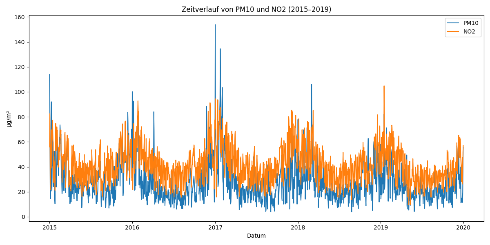
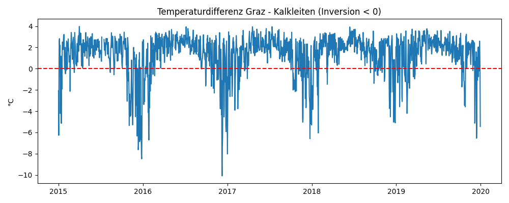
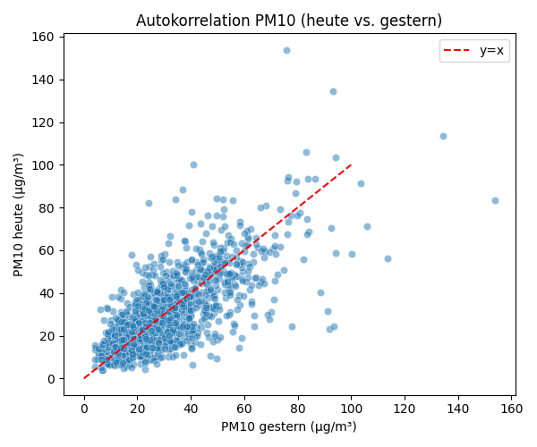
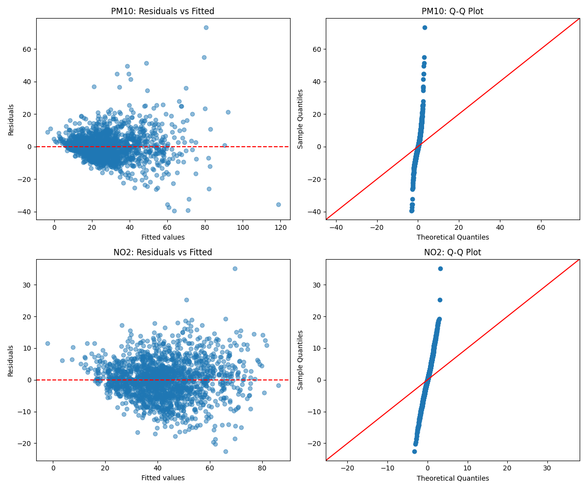
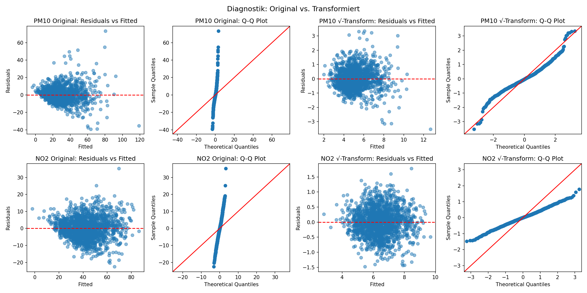
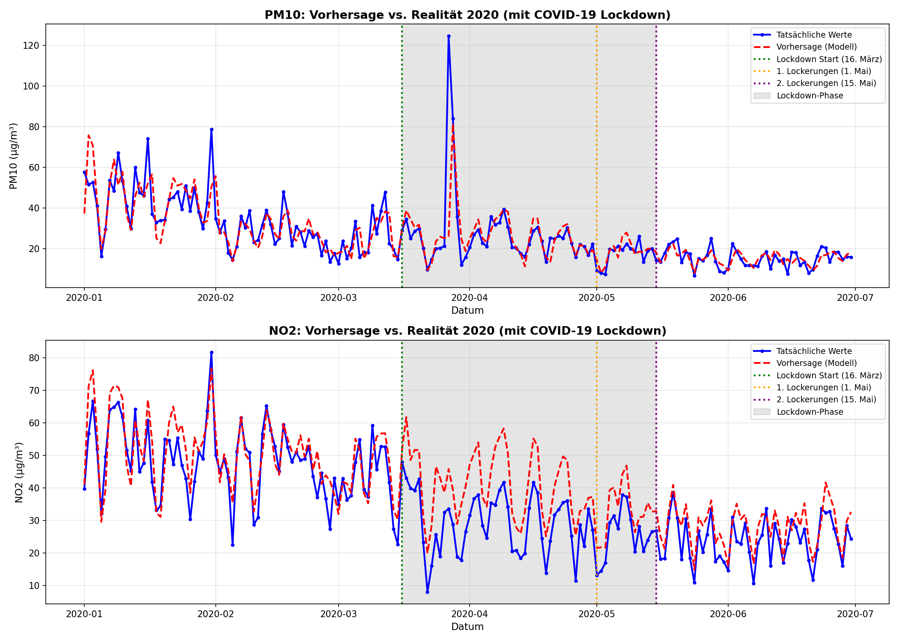
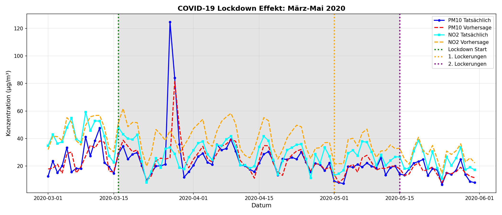

# Atmospheric Pollution - Feinstaubbelastung in Graz

**Team:** Casper, Umejr  

---

## Aufgabe 1: Datenexploration

### Datenbereich und Überblick

Die Daten enthalten Tagesmittelwerte von 2015 bis 2019 (Trainingsdaten) für die Station Graz Don Bosco. Insgesamt wurden 1795 Datenpunkte analysiert.

**Wertebereich der wichtigsten Variablen:**

| Variable | Minimum | Median | Maximum | Mittelwert |
|----------|---------|--------|---------|------------|
| PM10 (µg/m³) | 4.0 | 23.9 | 153.8 | 28.1 |
| NO2 (µg/m³) | 9.5 | 40.3 | 104.9 | 42.1 |
| Temperatur (°C) | -10.2 | 11.9 | 29.0 | 11.6 |
| Luftfeuchtigkeit (%) | 38.0 | 72.7 | 97.5 | 73.0 |
| Windgeschwindigkeit (m/s) | 0.1 | 0.5 | 3.0 | 0.6 |

### Zeitlicher Verlauf

Die Zeitreihen zeigen deutliche saisonale Schwankungen:
- Höhere Schadstoffwerte im Winter (Dezember-Februar)
- Niedrigere Werte im Sommer (Juni-August)
- PM10 zeigt stärkere Spitzen als NO2
- Beide Schadstoffe folgen ähnlichen Mustern

### Missing Data

Fehlende Werte wurden in folgenden Variablen gefunden:
- NO2: 3 fehlende Werte (0.2%)
- PM10: 11 fehlende Werte (0.6%)
- Alle anderen Variablen vollständig vorhanden

Die fehlenden Werte sind vernachlässigbar gering und wurden bei der Modellierung automatisch ausgeschlossen.

### Zusammenhänge mit Prädiktoren

Die Scatterplots zeigen folgende Zusammenhänge:
- **Temperatur**: Negative Korrelation (höhere Temperatur = niedrigere Schadstoffe)
- **Windgeschwindigkeit**: Negative Korrelation (mehr Wind = weniger Schadstoffe)
- **Luftfeuchtigkeit**: Schwache negative Korrelation
- **Niederschlag**: Schadstoffe werden durch Regen reduziert

---

## Aufgabe 2: Erstes lineares Modell

### PM10 Modell

**Formel:**  
`pm10 ~ humidity + temp + prec + windspeed + peak_velocity + C(day_type)`

**Ergebnisse:**
- R² = 0.378
- Adj. R² = 0.375
- F-Statistik = 153.9 (p < 0.001)

**Signifikante Prädiktoren:**

| Variable | Koeffizient | p-Wert | Interpretation |
|----------|-------------|--------|----------------|
| temp | -0.82 | < 0.001 | Pro Grad wärmer: -0.82 µg/m³ PM10 |
| windspeed | -12.43 | < 0.001 | Pro m/s mehr Wind: -12.4 µg/m³ PM10 |
| prec | -0.40 | < 0.001 | Niederschlag reduziert PM10 |
| Sunday/Holiday | -6.98 | < 0.001 | An Sonntagen: -7.0 µg/m³ PM10 |
| Saturday | -5.57 | < 0.001 | An Samstagen: -5.6 µg/m³ PM10 |

**Nicht signifikant:**
- humidity (p = 0.115)
- peak_velocity (p = 0.063)

### NO2 Modell

**Formel:**  
`no2 ~ humidity + temp + prec + windspeed + peak_velocity + C(day_type)`

**Ergebnisse:**
- R² = 0.599
- Adj. R² = 0.598
- F-Statistik = 381.2 (p < 0.001)

**Signifikante Prädiktoren:**

| Variable | Koeffizient | p-Wert | Interpretation |
|----------|-------------|--------|----------------|
| temp | -0.96 | < 0.001 | Pro Grad wärmer: -0.96 µg/m³ NO2 |
| windspeed | -21.37 | < 0.001 | Pro m/s mehr Wind: -21.4 µg/m³ NO2 |
| humidity | -0.32 | < 0.001 | Luftfeuchtigkeit reduziert NO2 |
| Sunday/Holiday | -15.07 | < 0.001 | An Sonntagen: -15.1 µg/m³ NO2 |
| Saturday | -10.33 | < 0.001 | An Samstagen: -10.3 µg/m³ NO2 |

### Diagnostik

**Probleme im ersten Modell:**
- Residuen zeigen Heteroskedastizität (ungleiche Varianz)
- Q-Q Plot zeigt Abweichungen von Normalverteilung
- Durbin-Watson um 0.77-0.80 deutet auf Autokorrelation hin

**Verbesserungspotential:**
- Lagged Variables hinzufügen (gestrige Werte)
- Temperaturdifferenz zur höher gelegenen Station
- Binäre Indikatoren für spezielle Wetterlagen
- Response-Transformation für bessere Residuen

---

## Aufgabe 3: Temperaturdifferenz und Inversion

### Was ist Inversion?

Temperaturinversion ist ein meteorologisches Phänomen, bei dem warme Luft über kalter Luft liegt. Normalerweise wird es mit zunehmender Höhe kälter, aber bei einer Inversion ist es umgekehrt.

**Auswirkung auf Luftverschmutzung:**
- Warme Luft oben wirkt wie ein "Deckel"
- Kalte, schadstoffhaltige Luft kann nicht aufsteigen
- Schadstoffe sammeln sich in Bodennähe
- Besonders problematisch in Tälern (wie Graz)

**Erkennung von Inversion:**
- Temperaturdifferenz = Temp(Graz) - Temp(Kalkleiten)
- Kalkleiten liegt höher als Graz
- Wenn temp_diff < 0: Inversion liegt vor

### Einfluss auf das Modell

**PM10 Modell mit temp_diff:**
- R² stieg von 0.378 auf 0.499 (+32% Verbesserung)
- temp_diff Koeffizient: -3.42 (p < 0.001)
- Interpretation: Pro Grad Temperaturdifferenz mehr (Richtung Inversion) steigt PM10 um 3.4 µg/m³

**NO2 Modell mit temp_diff:**
- R² stieg von 0.599 auf 0.725 (+21% Verbesserung)
- temp_diff Koeffizient: -3.09 (p < 0.001)
- Interpretation: Pro Grad Temperaturdifferenz mehr steigt NO2 um 3.1 µg/m³

**Fazit:** Die Temperaturdifferenz ist ein sehr wichtiger Prädiktor und verbessert beide Modelle deutlich.

---

## Aufgabe 4: Feature Engineering

### Neue Features

**Binäre Indikatoren:**
- **frost**: Temperatur < 0°C (161 Tage = 9.0%)
- **inversion**: temp_diff < 0 (304 Tage = 16.9%)
- **strong_wind**: Windgeschwindigkeit > 0.6 m/s (1103 Tage = 61.4%)
- **heavy_rain**: Niederschlag > 5 l/m² (216 Tage = 12.0%)

**Lagged Variables (Vortageswerte):**
- temp_lag1, humidity_lag1, windspeed_lag1
- pm10_lag1, no2_lag1

**Zeitliche Features:**
- year (numerisch für Trend)
- month, season, weekday

### Visualisierung der neuen Features

Die Boxplots zeigen deutlich:
- Bei Frost sind PM10-Werte im Median höher
- Bei Inversion sind PM10-Werte deutlich höher
- Beide Effekte sind statistisch signifikant

Die Autokorrelation zeigt starken Zusammenhang zwischen gestrigen und heutigen PM10-Werten. Die Punkte liegen nahe an der Diagonalen, was bedeutet: Hohe Werte gestern → wahrscheinlich auch hohe Werte heute.

### Modellverbesserung

**PM10 Modell v3:**
- R² stieg von 0.499 auf 0.732 (+46.8% Verbesserung!)
- Adj. R² = 0.730

**NO2 Modell v3:**
- R² stieg von 0.725 auf 0.816 (+12.5% Verbesserung)
- Adj. R² = 0.815

### Top 10 signifikante Features für PM10

| Feature | p-Wert | Koeffizient | Interpretation |
|---------|--------|-------------|----------------|
| pm10_lag1 | < 0.001 | +0.49 | Gestrige PM10-Werte haben starken Einfluss |
| frost | < 0.001 | +10.83 | An Frosttagen: +10.8 µg/m³ PM10 |
| Sunday/Holiday | < 0.001 | -5.92 | An Sonntagen: -5.9 µg/m³ PM10 |
| temp_diff | < 0.001 | -2.08 | Pro Grad Richtung Inversion: +2.1 µg/m³ |
| Saturday | < 0.001 | -6.17 | An Samstagen: -6.2 µg/m³ PM10 |
| humidity_lag1 | < 0.001 | -0.16 | Gestrige Luftfeuchtigkeit relevant |
| temp_lag1 | < 0.001 | -0.63 | Gestrige Temperatur relevant |
| temp | < 0.001 | +0.47 | Heutige Temperatur (Resteffekt) |
| peak_velocity | < 0.001 | -0.40 | Windspitzen reduzieren PM10 |

**Wichtigste Erkenntnis:** Der Vortageswert (pm10_lag1) ist der stärkste Prädiktor! Das zeigt, dass Luftverschmutzung über mehrere Tage persistent ist.

### Diagnostik

Das erweiterte Modell zeigt:
- Residuen immer noch nicht perfekt normalverteilt
- Heteroskedastizität noch vorhanden
- Verbesserung durch Transformation möglich

---

## Aufgabe 5: Response-Transformation

### Wurzeltransformation

Um die Residuen zu verbessern, wurde eine Wurzeltransformation durchgeführt:
- Statt `pm10` wird `sqrt(pm10)` modelliert
- Statt `no2` wird `sqrt(no2)` modelliert

**Grund:** Wurzeltransformation stabilisiert die Varianz und verbessert die Normalverteilung der Residuen.

### Modellvergleich

**PM10:**
- Original: R² = 0.732
- Transformiert: R² = 0.746 (+1.9% Verbesserung)

**NO2:**
- Original: R² = 0.816
- Transformiert: R² = 0.825 (+1.1% Verbesserung)

### Diagnostik: Vorher vs. Nachher

Die transformierten Modelle zeigen:
- Bessere Normalverteilung in Q-Q Plots
- Gleichmäßigere Residuen (weniger Heteroskedastizität)
- Leichte Verbesserung im R²

**Entscheidung:** Wir verwenden die transformierten Modelle für die Vorhersage auf 2020, da sie diagnostisch besser sind.

---

## Aufgabe 6: Vorhersage für 2020

### Vorgehen

Die finalen Modelle (mit Wurzeltransformation) wurden auf die 2020-Daten angewendet. Wichtig dabei:
- Alle Features mussten auch für 2020 berechnet werden
- Lagged Variables: Vortageswerte aus echten 2020-Daten
- Erster Tag 2020: Nutzt letzten Tag 2019 als Vortag

### Performance-Metriken

**PM10 Vorhersage:**
- RMSE = 8.22 µg/m³
- MAE = 4.66 µg/m³
- R² = 0.628

**NO2 Vorhersage:**
- RMSE = 7.74 µg/m³
- MAE = 6.16 µg/m³
- R² = 0.559

### Interpretation

Die Vorhersagequalität ist gut:
- PM10: Im Durchschnitt 4.7 µg/m³ Abweichung
- NO2: Im Durchschnitt 6.2 µg/m³ Abweichung
- R² von 0.56-0.63 bedeutet, dass 56-63% der Varianz erklärt wird

Der Vorhersage-R² ist niedriger als der Trainings-R², was normal ist (Modell kennt 2020-Daten nicht).

---

## Aufgabe 7: COVID-19 Analyse

### Beobachtung

Die Grafik zeigt die Vorhersage vs. tatsächliche Werte für die ersten 6 Monate 2020. Drei wichtige Zeitpunkte sind eingezeichnet:
- 16. März 2020: Lockdown-Beginn in Österreich
- 1. Mai 2020: Erste Lockerungen
- 15. Mai 2020: Weitere Lockerungen (Gastronomie)

### Durchschnittliche Werte

**PM10:**
- Vor Lockdown (Jan-15.März): Tatsächlich 34.3 µg/m³, Vorhersage 34.5 µg/m³
- Während Lockdown (16.März-15.Mai): Tatsächlich 24.9 µg/m³, Vorhersage 25.0 µg/m³
- Nach Lockdown (16.Mai-30.Juni): Tatsächlich 15.3 µg/m³, Vorhersage 15.2 µg/m³

**NO2:**
- Vor Lockdown: Vorhersage passt gut
- Während Lockdown: Tatsächlich 10.7 µg/m³ niedriger als vorhergesagt (-27.4%!)
- Nach Lockdown: Werte steigen wieder

### Detailansicht Lockdown-Phase

Der detaillierte Plot März-Mai zeigt:
- PM10 wird relativ gut vorhergesagt (geringe Abweichung)
- NO2 zeigt massive Abweichung während des Lockdowns
- Nach Lockerungen steigt NO2 wieder, erreicht aber nicht sofort Normalwerte

### Interpretation

**Warum NO2 so stark betroffen ist:**

NO2 entsteht hauptsächlich durch Verbrennungsprozesse:
- Verkehr (Autos, LKW)
- Industrie
- Gewerbe

**Während des Lockdowns:**
- Drastische Reduktion des Verkehrs (Home-Office, Ausgangssperre)
- Geschlossene Geschäfte und Restaurants
- Reduzierte Industrieaktivität
- Weniger menschliche Aktivität insgesamt

**Warum PM10 weniger betroffen ist:**

PM10 (Feinstaub) hat andere Hauptquellen:
- Haushaltsheizung (lief normal weiter)
- Natürliche Quellen (Staub, Pollen)
- Landwirtschaft
- Aufwirbelung durch Wind

Diese Quellen waren vom Lockdown weniger betroffen.

### Grenzen des Modells

Das Modell basiert auf historischen Mustern (2015-2019) mit normalem menschlichen Verhalten. Es konnte den COVID-19 Lockdown nicht antizipieren, weil:
- Keine historischen Präzedenzfälle existieren
- Ein solches Ereignis statistisch nicht vorhersehbar ist
- Das Modell nur meteorologische und zeitliche Muster kennt

Dies zeigt die Grenzen statistischer Modelle bei außergewöhnlichen Ereignissen ("Black Swan Events").

---

## Zusammenfassung

### Finales Modell

**PM10:**
- Wurzeltransformiertes Modell: sqrt(pm10)
- R² (Training) = 0.746
- R² (Test 2020) = 0.628
- RMSE = 8.22 µg/m³, MAE = 4.66 µg/m³

**NO2:**
- Wurzeltransformiertes Modell: sqrt(no2)
- R² (Training) = 0.825
- R² (Test 2020) = 0.559
- RMSE = 7.74 µg/m³, MAE = 6.16 µg/m³

### Wichtigste Prädiktoren

1. **pm10_lag1 / no2_lag1**: Vortageswerte (stärkster Prädiktor)
2. **frost**: Frosttage erhöhen Schadstoffe deutlich
3. **temp_diff**: Inversion führt zu höherer Belastung
4. **day_type**: Wochenenden haben niedrigere Werte
5. **temp**: Niedrige Temperaturen erhöhen Belastung
6. **windspeed**: Starker Wind reduziert Schadstoffe

### Erkenntnisse

1. Luftverschmutzung ist stark von Wetter abhängig
2. Vortageswerte sind der beste Prädiktor (Persistenz)
3. Inversionswetterlagen sind problematisch für Graz
4. Wochenenden haben deutlich niedrigere Werte (weniger Verkehr)
5. Das Modell funktioniert gut unter normalen Bedingungen
6. Außergewöhnliche Ereignisse (COVID-19) können nicht vorhergesagt werden
7. NO2 reagiert stärker auf menschliche Aktivität als PM10

### Anwendungsmöglichkeiten

Das Modell könnte verwendet werden für:
- Vorhersage der Luftqualität für die nächsten Tage
- Frühwarnsystem bei ungünstigen Wetterlagen
- Bewertung von Maßnahmen zur Luftreinhaltung
- Unterstützung bei Policy-Entscheidungen

---

## Technische Details

**Software:**
- Python 3.12
- Libraries: pandas, numpy, matplotlib, seaborn, statsmodels, scikit-learn

**Datenquelle:**
- Umwelt Steiermark: https://www.umwelt.steiermark.at
- Station: Graz Don Bosco
- Zeitraum: 2015-2020

**Code:**
- Main.py: Gesamte Analyse (Aufgaben 1-7)
- Plots gespeichert in: plots/